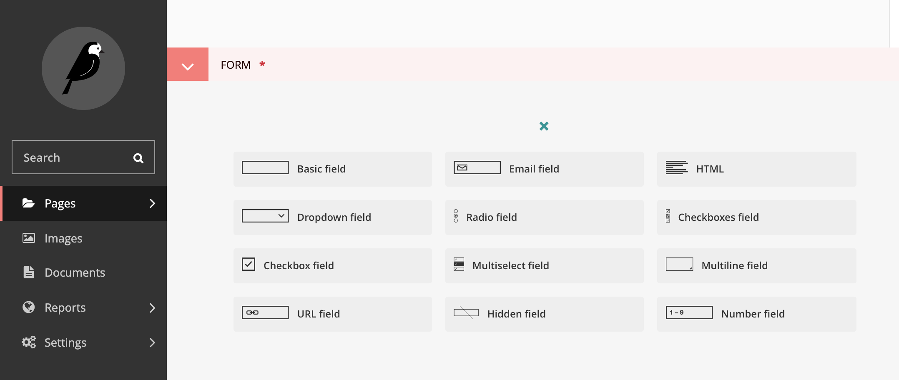

# Wagtail Advanced Form Builder

# About

Wagtail Advanced Form Builder is an extension on top of Wagtail's in-built Form Builder. It provides the ability to 
create forms with conditional logic.

# Documentation

The documentation for using and developing with Wagtail Advanced Form Builder can be found at https://wagtail-advanced-form-builder.readthedocs.io/en/latest/

# Features

* Support for the following fields:
    * Single line field
    * Select dropdown field
    * Email field
    * Hidden field
    * Multi line field
    * Multi select field
    * Number field
    * Radio field
    * Checkbox field
    * Multiple checkbox field
    * Inline HTML field
    * ...More fields to come...
* Conditional show hide actions on each field type including
    * Is equal to
    * Is not equal to
    * Greater than
    * Greater than or equal to
    * Less than
    * Less than or equal to
    * Contains
    * Starts with
    * Ends with
    * Is blank
    * Is not blank            
* Multiple conditions can be added for each field    

# Getting Help

Please report bugs or issues using the [Issue Tracker](https://github.com/octavenz/wagtail-advanced-form-builder/issues) 

# Authors

* Richard Blake ([Octave](https://octave.nz))

# License

This project is licensed under the BSD License - see the [LICENSE file](./LICENCE) for details

