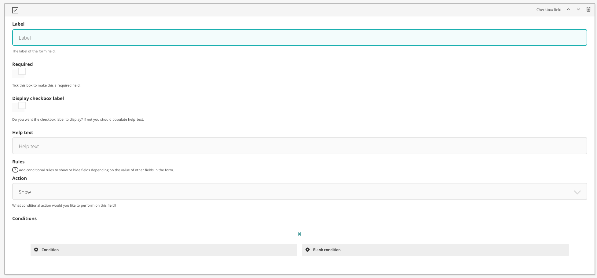

# Checkbox field

The checkbox field is a standard input type checkbox 

## Configuration options

There are a number of fields that can be manipulated to serve a checkbox field

### Label

The 'name' of the field

### Required

Whether or not it is a required field

### Display checkbox label

Whether the checkbox label field should be displayed above the checkbox

### Help text

Set the help text to sit alongside the field. This can also act as the label on the frontend for this field.

### Rules and conditions

Set conditional display rules based on other form field values.

