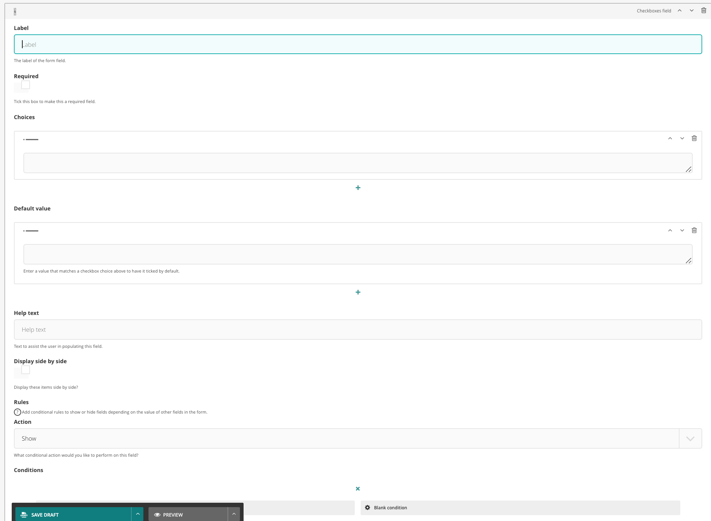

# Checkboxes field

The checkboxes field is a standard input type checkbox group

## Configuration options

There are a number of fields that can be manipulated to serve a checkboxes field

### Label

The 'name' of the field

### Required

Whether or not it is a required field

### Choices

Checkbox choices

### Default value

Enter multiple checkbox choices to be checked by default

### Help text

Set the help text to sit alongside the field

### Display side by side

Whether or not the checkboxes should display in a flex row or stack vertically

### Rules and conditions

Set conditional display rules based on other form field values.

