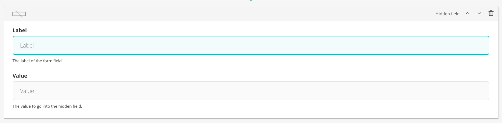

# Hidden field

The hidden field is a standard hidden input.

## Configuration options

There are a number of fields that can be manipulated to serve a hidden field

### Label

The 'name' of the field

### Value

The value to go into the field

