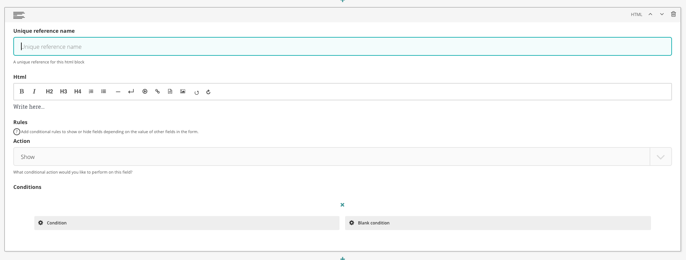

# HTML field

The HTML field allows you to add HTML using a rich text editor inline within the form and also then 
conditionally show or hide that HTML based on the values of fields in the form.

## Configuration options

There are a number of fields that can be manipulated to serve a HTML field

### Unique reference name

A unique name for this HTML block. It is not displayed to the user.

### HTML

The HTML you want to display

### Rules and conditions

Set conditional display rules based on other form field values.
