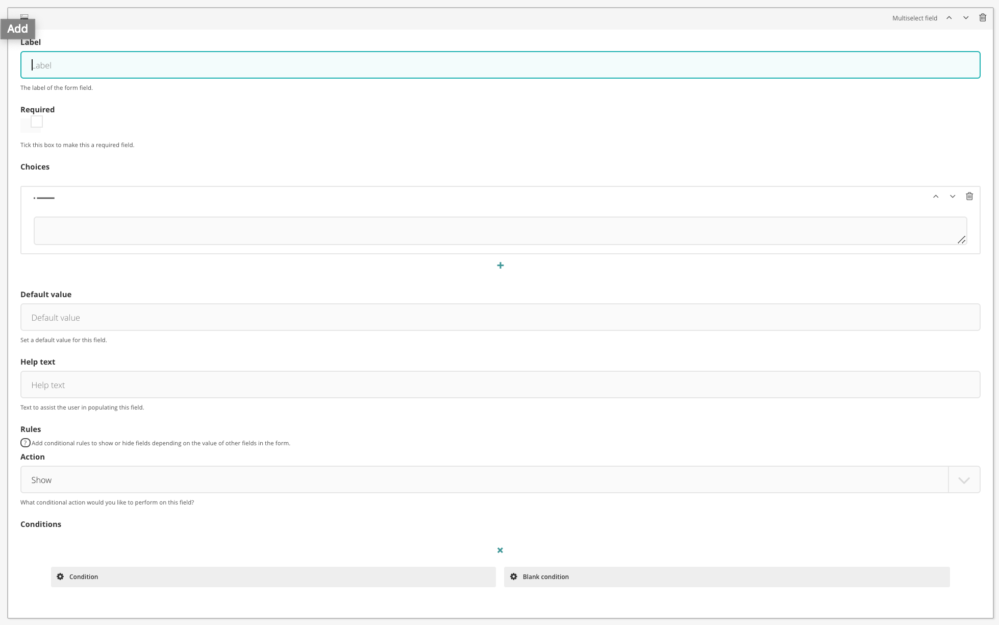

# Multiselect field

The multiselect field is a standard select field with multiple attribute

## Configuration options

There are a number of fields that can be manipulated to serve a multiselect field

### Label

The 'name' of the field

### Required

Whether or not it is a required field

### Choices

The options to display in the select dropdown multiple

### Default value

Set a default value to display in the dropdown

### Help text

Set the help text to sit alongside the field

### Rules and conditions

Set conditional display rules based on other form field values.

