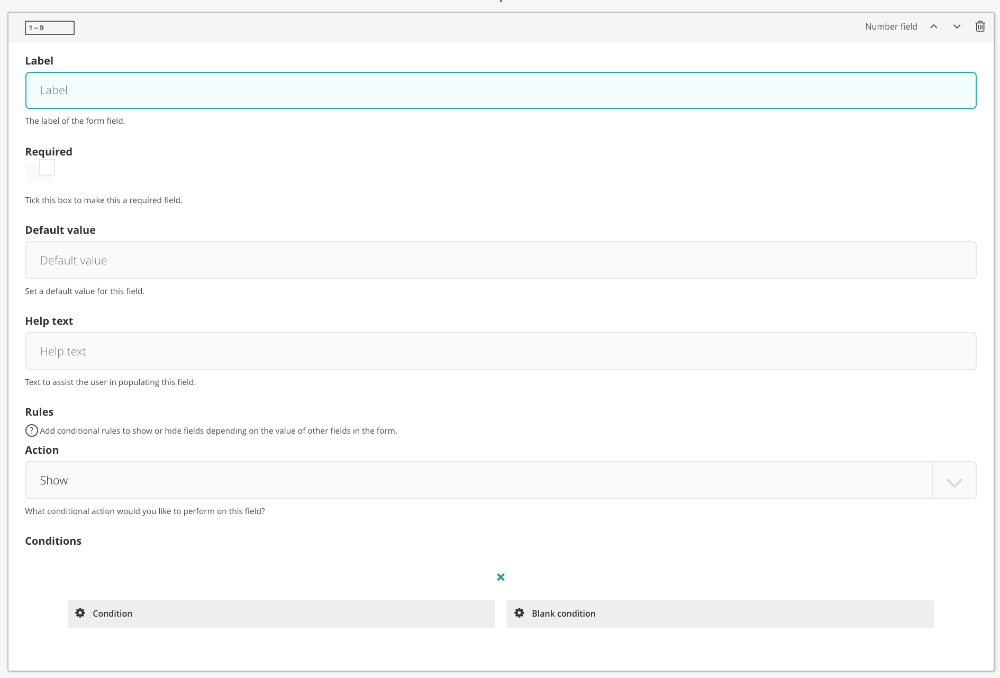

# Number field

The number field renders a number input.

## Configuration options

There are a number of fields that can be manipulated to serve a number field

### Label

The 'name' of the field

### Required

Whether or not it is a required field

### Default value

Set a default value to display in the field when the form initialises

### Help text

Set the help text to sit alongside the field

### Rules and conditions

Set conditional display rules based on other form field values.

