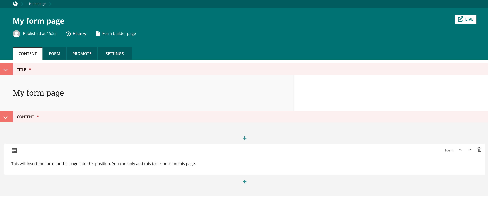

# Using a custom page model

The most likely scenario for using this package is to use your own defined Page model which inherits from the 
abstract form classes the package provides. 

## Example

The following is an example of implementing a custom Page model which uses the package provided streamfield block: InlineFormBlock.

You'll need to implement:

0. A form field that inherits from AbstractAdvancedFormField and defines a page parental key foreign relationship to your page model.
0. A Page model that inherits from AbstractAdvancedEmailForm and defines a form_field property that is set to your form field model.

This will give you a page setup that looks something like below with your Form configurable in the second tab:

        from django.db import models
        from django.utils.translation import ugettext_lazy as _

        from wagtail.admin.edit_handlers import TabbedInterface, ObjectList, StreamFieldPanel        
        from wagtail.core.fields import StreamField
        from wagtail.core.models import Page    
        from wagtail.core import blocks            
        
        from wagtail_advanced_form_builder.models.abstract_advanced_email_form import AbstractAdvancedEmailForm
        from wagtail_advanced_form_builder.models.abstract_advanced_form_field import AbstractAdvancedFormField
        from wagtail_advanced_form_builder.blocks import InlineFormBlock

        from modelcluster.fields import ParentalKey
                
        
        class FormBuilderEmailFormField(AbstractAdvancedFormField):
        
            page = ParentalKey(
                'app.EmailFormBuilderPage',
                on_delete=models.CASCADE,
                related_name='form_fields'
            )
        
                
        class EmailFormBuilderPage(Page, AbstractAdvancedEmailForm):
        
            form_field = FormBuilderEmailFormField
        
            content = StreamField(
                [
                    ('paragraph', blocks.RichTextBlock()),
                    ('form', InlineFormBlock()),  # Provided by Wagtail Advanced Form Builder
                ],   
                default=None,
                null=True,
            )
            
            content_panels = Page.content_panels + [
                StreamFieldPanel('content'),
            ]            
        
            edit_handler = TabbedInterface([
                ObjectList(content_panels, heading=_('Content')),
                ObjectList(AbstractAdvancedEmailForm.content_panels, heading=_('Form')),
                ObjectList(Page.promote_panels, heading=_('Promote')),
                ObjectList(Page.settings_panels, heading=_('Settings'), classname="settings"),
            ])
            
            def get_template(self, request, *args, **kwargs):
                return 'app/email_form_builder_page.html'
            
            
Your Page model HTML template then just needs to iterate over the Streamfield blocks defined in the content property. If
you extend from the base wagtail_advanced_form_builder/page/form.html (which extends from base.html) it will include all the JS and CSS the page needs to render and validate the form:

            
            
            
            
                

                    <h1>
                        {{ page.title }}
                    </h1>
                    
                        
                    
                

            
         
        
The form will be rendered inline with your other Streamfield block content.        
            
            
