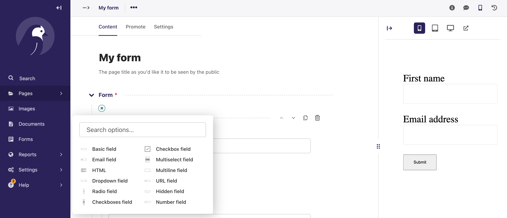

# Wagtail Advanced Form Builder Documentation

Wagtail Advanced Form Builder is an extension on Wagtail's in-built Form Builder.

It allows you to create forms with conditional logic for field visibility and validation. e.g. The display of one field may be dependent on the value of one or many other fields. 

